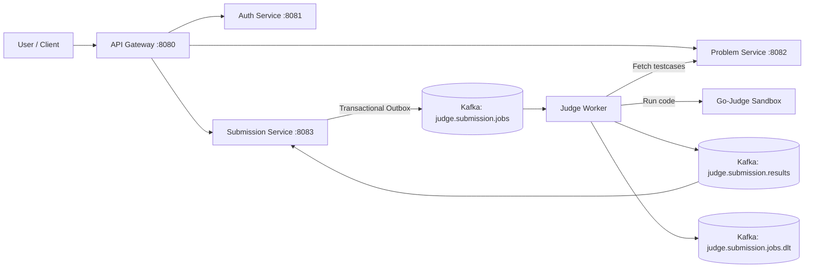

# Go Judge System - High Performance Online Judge Backend


**Go Judge System** is a distributed Online Judge backend built for high-concurrency code submission workloads.
It solves the core pain point of scalable and safe code execution by combining Go microservices, Kafka event streams, and sandbox isolation.

---

## Elevator Pitch & Highlights

- **Built for concurrency**: asynchronous judge pipeline with Kafka.
- **Built for reliability**: transactional outbox, retry/backoff, dead-letter routing.
- **Built for operability**: graceful shutdown, structured logging, container-first deployment.

---

## System Architecture



Data flow:
- User -> API Gateway -> Submission Service
- Submission Service -> Kafka Job Topic -> Judge Worker
- Judge Worker -> Sandbox -> Kafka Result Topic -> Submission Service

---

## Getting Started (Quick Start)

### Prerequisites

- Docker Engine
- Docker Compose
- Go 1.24+ (optional for local development)

### Run in 2 minutes

```bash
git clone https://github.com/nvawntien/go-judge-system.git
cd go-judge-system
docker compose --profile dev --profile worker up -d --build
```

### Verify services

```bash
docker compose ps
```

### Access points

- Gateway: `http://localhost:8080`
- Kafka UI (dev profile): `http://localhost:8081`
- MailHog UI (dev profile): `http://localhost:8025`
- Service health endpoints are internal to the Docker network; use the gateway for public APIs, or run a service locally when you need direct health checks.

### Stop

```bash
docker compose down
```

---

## Folder Structure

```text
.
├── api-tests/             # Bruno API collections for manual and regression testing
├── services/auth/         # Authentication and identity service
├── services/problem/      # Problem and testcase management service
├── services/submission/   # Submission API + outbox + result consumer
├── workers/judge/         # Background judge worker (Kafka consumer)
├── pkg/                   # Shared modules (config, kafka, contracts, logger)
├── gateway/               # Krakend gateway + JWT validation config
├── build/                 # Build assets, including the sandbox image definition
│   └── sandbox/           # Sandbox image (criyle/executorserver based)
├── environment/           # Shared environment variable files for local compose runs
├── infra/                 # Infrastructure bootstrap assets (Postgres, Redis, MinIO, etc.)
├── test_cases/            # Sample testcase fixtures mounted into the sandbox
├── docker-compose.yml     # Full local stack definition
├── go.work                # Workspace definition for the monorepo
├── generate_bruno.sh      # Helper script for Bruno collection generation
└── LICENSE                # Project license
```

Repository map:

- `api-tests/`: request collections for exercising the HTTP APIs without writing ad hoc scripts.
- `build/`: build-time assets, including the sandbox runtime image.
- `environment/`: example environment files used by Docker Compose and service containers.
- `gateway/`: Krakend gateway configuration and shared auth material.
- `infra/`: bootstrap SQL and infrastructure-specific resources.
- `pkg/`: shared code reused by multiple services.
- `services/`: business services for auth, problems, and submissions.
- `test_cases/`: sample execution fixtures mounted into the sandbox runtime.
- `workers/`: asynchronous background workers.

---

## Tech Stack

| Category | Technology |
| :--- | :--- |
| **Language** | Go 1.24 |
| **API Framework** | Gin |
| **Message Broker** | Apache Kafka (KRaft mode) |
| **Datastores** | PostgreSQL, Redis |
| **Judge Engine** | criyle/executorserver |
| **Infrastructure** | Docker, Docker Compose |
| **Dependency Injection** | Google Wire |

---

## Key APIs & Production Features

### Primary APIs

| Method | Endpoint | Description |
| :--- | :--- | :--- |
| `POST` | `/api/v1/submissions` | Create a new submission |
| `GET` | `/api/v1/my/submissions` | List current user's submissions |
| `GET` | `/api/v1/problems` | List public problems |
| `POST` | `/api/v1/auth/login` | Authenticate and issue tokens |

### Production-grade capabilities

- **Transactional Outbox** for safe job publishing.
- **Event-driven judge pipeline** using Kafka.
- **Dead Letter Topic (DLT)** for unrecoverable jobs.
- **Graceful shutdown** for services and workers.
- **JWT validation + claim propagation** at gateway layer.

### Event contracts

- `judge.submission.jobs`: `pkg/judge/job_message.go`
- `judge.submission.results`: `pkg/judge/result_message.go`
- `judge.submission.jobs.dlt`: `workers/judge/internal/adapter/inbound/kafka/dlt_publisher.go`

---

Built for the Go Judge System.
