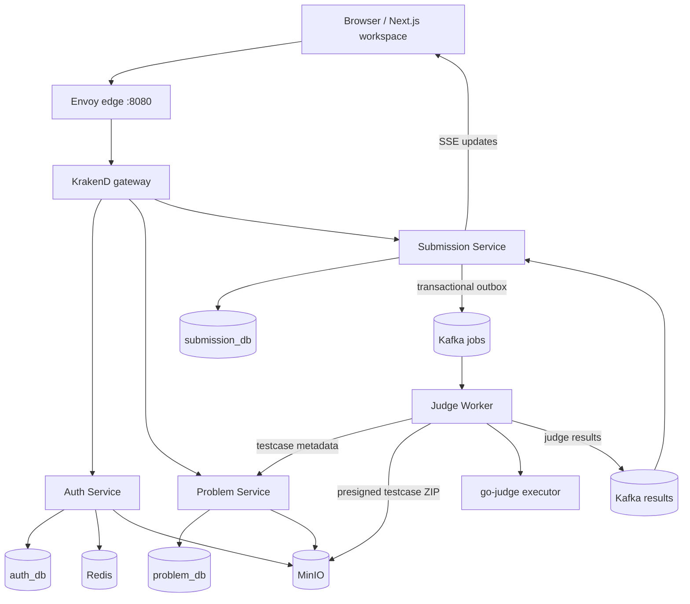

# AstraCode

[](https://github.com/nvawntien/go-judge-system)
[](https://go.dev/)
[](https://nextjs.org/)
[](https://www.docker.com/)
[](LICENSE)

AstraCode is a self-hosted, event-driven Online Judge built with Go services,
a modern Next.js workspace, and isolated program execution. It covers the core
competitive-programming lifecycle: author a problem, moderate it, solve it,
run code, submit against official testcases, and review results and statistics.

> **v0.1.0** is the first public release of the core AstraCode judge platform.
> It is production-oriented in architecture, but operators must complete the
> deployment and security work described below before exposing it publicly.

## Highlights

- **Competitive-programming workspace** — searchable problem catalog,
  structured statements, custom runs, official submissions, verdict detail, and
  submission history for C++, Go, Python, and Java.
- **Durable asynchronous judging** — Submission Service writes a submission,
  attempt, and outbox record in one PostgreSQL transaction; Kafka carries jobs
  to Judge Worker and results back to Submission Service.
- **Correctness-aware results** — `AttemptID` correlates a submit or rejudge
  attempt, while result application rejects stale and duplicate updates before
  live SSE notifications are emitted.
- **Authoring and moderation** — Contributors own hidden drafts and testcase
  packages; Moderator/Admin roles control publication and catalog management.
- **User-facing product** — authentication, profiles, aggregate competitive
  statistics, activity heatmaps, public user search, and responsive light/dark UI.

## Architecture

AstraCode separates services by data ownership: Auth owns identity and sessions,
Problem owns catalog and testcase metadata, Submission owns submission state and
statistics, and Judge Worker owns asynchronous execution orchestration.


```mermaid
flowchart TB
  browser[Browser / Next.js workspace] --> edge[Envoy edge :8080]
  edge --> gateway[KrakenD gateway]

  gateway --> auth[Auth Service]
  gateway --> problem[Problem Service]
  gateway --> submission[Submission Service]

  auth --> authdb[(auth_db)]
  auth --> redis[(Redis)]
  auth --> minio[(MinIO)]
  problem --> problemdb[(problem_db)]
  problem --> minio
  submission --> submissiondb[(submission_db)]

  submission -->|transactional outbox| jobs[(Kafka jobs)]
  jobs --> worker[Judge Worker]
  worker -->|testcase metadata| problem
  worker -->|presigned testcase ZIP| minio
  worker --> executor[go-judge executor]
  worker -->|judge results| results[(Kafka results)]
  results --> submission
  submission -->|SSE updates| browser
```

### Official judging lifecycle

1. The browser submits source code through Envoy and KrakenD to Submission Service.
2. Submission Service validates the request and Problem access, then creates a
   submission, immutable attempt, and outbox record in one transaction.
3. The outbox relay publishes the committed job to `judge.submission.jobs`.
4. Judge Worker consumes the job, obtains testcase metadata from Problem Service,
   and downloads the private testcase bundle from MinIO.
5. The worker invokes the go-judge executor with configured compilation, time,
   memory, process, and output limits.
6. The worker publishes `judge.submission.results`, or sends a job to the DLT
   after its retry policy is exhausted.
7. Submission Service transactionally applies only the result for the current
   `AttemptID` and ignores stale terminal duplicates.
8. After commit, Submission Service emits an in-process SSE update to the client.

Kafka delivery is at least once across the broker/database boundary. The outbox
and attempt-aware result application guard against lost publication and stale
result application. See [architecture](docs/codebase/ARCHITECTURE.md) and
[execution flows](docs/codebase/FLOWS.md) for the code-level trace.

## Product capabilities

### Solving and judging

- Public catalog with search, filters, tags, difficulty, and limits.
- Structured statements: description, input, output, constraints, hints, and examples.
- Browser editor with syntax highlighting, local drafts, custom testcase runs,
  official submissions, verdict diagnostics, and live status updates.
- Official execution for **C++**, **Go**, **Python**, and **Java**.
- Submission detail/history and Moderator/Admin rejudge support.

### Authoring and moderation

- Contributor-owned hidden drafts with authoritative server-side `author_id`.
- Structured problem authoring for content, tags, examples, constraints, and hints.
- Private testcase ZIP management for an owned hidden draft.
- Moderator/Admin publication, hiding, catalog management, and tag taxonomy
  management in the Admin Console.

### Accounts and profiles

- Registration, email verification, password reset/change, refresh, logout, and logout-all.
- Public profiles and user search for active, non-suspended accounts.
- Submission-owned solved/attempted totals, verdict/language distributions, and
  365-day UTC activity.

## Services

| Component | Responsibility |
| --- | --- |
| `website` | Next.js application for solvers, contributors, and administrators. |
| `auth-service` | Identity, sessions, profile media, roles, suspension, and public-user lookup. |
| `problem-service` | Problems, tags, contributor ownership, testcase metadata, and object storage access. |
| `submission-service` | Submission/attempt/result state, transactional outbox, profile statistics, and SSE. |
| `judge-worker` | Kafka consumption, testcase retrieval, executor orchestration, and result publication. |
| `gateway` | KrakenD API composition, JWT validation, and trusted identity propagation. |
| `envoy` | Public edge routing for API and submission-event traffic. |
| `go-judge` | Executorserver-based isolated program execution runtime. |

## Technology stack

| Area | Technology |
| --- | --- |
| Services | Go **1.25.8**, Gin, gRPC, GORM, Google Wire, Zap |
| Frontend | Next.js **15.5.4**, React **19.1.1**, TypeScript |
| Messaging | Apache Kafka **4.0.0** in KRaft mode, Sarama |
| Data | PostgreSQL **15.6**, Redis **7.2**, MinIO |
| Execution | `criyle/executorserver`-based go-judge image with C/C++, Python, and Go tooling |
| Edge | Envoy **1.34.2**, KrakenD **2.6.0** |
| Local topology | Docker Compose, persistent volumes, health checks, and resource limits |

## Roles and authoring workflow

| Role | Primary product responsibility |
| --- | --- |
| User | Browse public problems, run code, submit solutions, and view personal statistics. |
| Contributor | Manage owned hidden problem drafts and testcase packages. Published contributions are read-only in the Contributor Workspace. |
| Moderator | Review and manage the problem catalog, including publication/hiding and moderation actions. |
| Admin | Platform administration plus the full Admin Console management surface. |

Contributor Workspace and Admin Console are deliberately separate product
surfaces. Backend role inheritance does not make Moderator/Admin accounts use
the Contributor navigation workflow.

## Quick start

### Requirements

- Git
- Docker Engine with Docker Compose
- Node.js and npm for the Next.js frontend
- Go 1.25.8 only when running Go modules outside Docker

### Start the local judge stack

```bash
git clone https://github.com/nvawntien/go-judge-system.git
cd go-judge-system

docker compose --profile dev --profile worker up -d --build
docker compose ps
```

The `worker` profile is required for official asynchronous judging; `dev` enables
MailHog and Kafka UI. Compose starts the edge, gateway, services, Kafka,
storage, and executor. Start the Next.js app separately.

### Start the frontend

```bash
cd website
test -f .env.local || cp .env.example .env.local
npm ci
npm run dev
```

The example frontend configuration targets the local Envoy edge. Adjust it for
your environment before opening the browser app.

### Local endpoints

| Endpoint | Purpose |
| --- | --- |
| `http://localhost:3000` | AstraCode frontend after `npm run dev` |
| `http://localhost:8080` | Envoy public edge and API gateway |
| `http://localhost:8081` | Kafka UI with the `dev` profile |
| `http://localhost:8025` | MailHog UI with the `dev` profile |

Stop the local stack with:

```bash
docker compose down
```

## Development and validation

This is a Go workspace with separate modules. Run Go checks per module rather
than assuming a root-level test target:

```bash
for module in pkg services/auth services/problem services/submission workers/judge; do
  (cd "$module" && go test ./... && go vet ./... && go test -race ./...)
done

(cd website && npm run typecheck && npm run build)
docker compose config --quiet
```

Service configuration is under `services/*/config/` and `workers/judge/config/`.
Compose reads local runtime values from `environment/`; the frontend template is
[`website/.env.example`](website/.env.example). Do not reuse local credentials
or JWT secrets for any shared or public deployment.

Further technical documentation:

- [Overview](docs/codebase/OVERVIEW.md)
- [Architecture](docs/codebase/ARCHITECTURE.md)
- [Services](docs/codebase/SERVICES.md)
- [Domain model](docs/codebase/DOMAIN.md)
- [Data ownership](docs/codebase/DATA.md)
- [Execution flows](docs/codebase/FLOWS.md)
- [Concurrency](docs/codebase/CONCURRENCY.md)
- [Development](docs/codebase/DEVELOPMENT.md)
- [Technical debt](docs/codebase/TECH_DEBT.md)

## Repository structure

```text
.
├── website/                 # Next.js AstraCode frontend
├── services/
│   ├── auth/                # identity, sessions, roles, profiles
│   ├── problem/             # catalog, authoring, tags, testcases
│   └── submission/          # submission state, outbox, results, SSE
├── workers/judge/           # Kafka judge consumer and run-code gRPC service
├── pkg/                     # shared Go configuration, middleware, contracts, clients
├── proto/                   # internal gRPC contracts
├── gateway/                 # KrakenD configuration and endpoint definitions
├── envoy/                   # public edge proxy configuration
├── build/sandbox/           # executor image definition
├── infra/                   # PostgreSQL and Kafka bootstrap assets
├── environment/             # local Compose runtime configuration
├── docs/codebase/           # source-grounded architecture and operations notes
├── docker-compose.yml       # self-hosted local/reference topology
└── go.work                  # Go workspace definition
```

## Deployment notes

The included Compose stack is a local/self-hosted reference topology, not a
complete public-internet deployment recipe. Before exposing AstraCode, provide:

- TLS termination and a controlled reverse-proxy/edge configuration.
- Unique, securely managed JWT, database, Redis, MinIO, SMTP, and internal-service secrets.
- Persistent volumes, database backups, restore testing, and log retention.
- Network rules that keep service and internal gRPC ports unreachable from
  untrusted clients; services rely on gateway-propagated identity headers.
- Resource limits and operational monitoring appropriate to the deployment.
- A host-level review of the privileged executor container and sandbox boundary.

Known limits include in-process SSE fan-out, no checked-in DLT replay consumer,
and runtime `AutoMigrate` schema changes. Review
[technical debt](docs/codebase/TECH_DEBT.md) before a multi-replica or public deployment.

## Security model

- KrakenD validates JWTs for protected gateway routes and propagates trusted
  identity claims to internal services.
- Auth records Redis-backed issued-at cutoffs for logout-all, suspension, and
  password lifecycle invalidation.
- Role middleware and Problem ownership checks enforce contributor, moderator,
  and admin boundaries server-side.
- Hidden testcase packages are separate from public problem statements; workers
  receive presigned metadata rather than exposing bundles to users.
- Untrusted code executes through go-judge with configured resource limits.
  This is an isolation boundary requiring deployment-specific review, not a
  blanket security guarantee.

## Roadmap

v0.1.0 focuses on:

```text
problem authoring → moderation → solving → sandboxed judging → submissions and statistics
```

Planned areas include editorial/solution workflows, discussions, contest
orchestration, standings, and rating. They are not presented as released
features.

## License

Distributed under the [MIT License](LICENSE).
