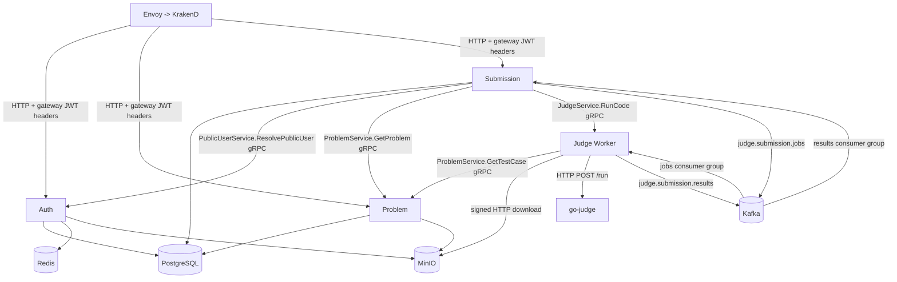

# Architecture

## Service boundaries and layers

All four Go runtime components follow the same directional dependency pattern: inbound adapters call application inbound ports/use cases; use cases depend on outbound ports; outbound adapters own databases, brokers, storage, or RPC clients. `internal/container/providers.go` in each service is the concrete composition root consumed by the Wire entrypoint in `cmd/server/wire.go`.

| Runtime | Responsibility | Inbound | Outbound |
| --- | --- | --- | --- |
| Auth | Identity, sessions, roles, user suspension and profile media | Gin HTTP, gRPC `PublicUserService` | PostgreSQL, Redis, JWT signer, bcrypt, SMTP, MinIO |
| Problem | Problem catalogue and testcase administration | Gin HTTP, gRPC `ProblemService` | PostgreSQL, MinIO presigned URLs |
| Submission | Submission lifecycle and client result delivery | Gin HTTP/SSE, Kafka result consumer | PostgreSQL, Kafka, Auth gRPC, Problem gRPC, Judge gRPC |
| Judge Worker | Durable judging and synchronous run-code service | Kafka job consumer, gRPC `JudgeService` | Problem gRPC, HTTP go-judge executor, Kafka results, local testcase cache |

## Communication graph

### Synchronous paths

* Client -> gateway -> Gin services: KrakenD endpoint JSON is authoritative for public exposure. Service routers may contain endpoints that are not necessarily routed publicly; compare `gateway/settings/` with router files before changing an API.
* Submission -> Problem gRPC `GetProblem`: verifies canonical problem metadata/access before persisting a submission (`services/submission/internal/adapter/outbound/problem/grpc_client.go`).
* Submission -> Auth gRPC `ResolvePublicUser`: resolves an active, non-suspended username to a stable user ID before serving public competitive aggregates. Auth owns this visibility decision; Submission then reads only its own database.
* Submission -> Judge Worker gRPC `RunCode`: serves the interactive `/api/v1/submissions/run` feature, with request validation/limits in the Submission use case and worker execution adapter.
* Judge Worker -> Problem gRPC `GetTestCase`: obtains a presigned testcase ZIP URL, count and version; the worker downloads it itself (`workers/judge/internal/adapter/outbound/problem/grpc_metadata_reader.go`).
* Judge Worker -> go-judge: HTTP `/run`; compilation/execution commands and limits are built in `workers/judge/internal/adapter/outbound/execute/go_judge_client.go`.

### Asynchronous paths

| Source | Contract | Destination | Purpose |
| --- | --- | --- | --- |
| Submission outbox relay | `judge.submission.jobs`, `pkg/judge.JobMessage` | Judge Worker Kafka consumer group | Durable official-judge request |
| Judge Worker | `judge.submission.results`, `pkg/judge.ResultMessage` | Submission result consumer group | Persist terminal result and per-test summary |
| Judge Worker retry failure | `judge.submission.jobs.dlt` | No consumer found | Retain jobs after retry exhaustion |

Kafka messages are keyed by submission ID. `AttemptID` is carried as the attempt/idempotency identity. The exact idempotence behavior is enforced by the result application use case; see `services/submission/internal/application/usecase/result/apply_judge_result.go`.

## Important execution paths

### Official submission

1. `POST /api/v1/submissions` enters `CreateSubmission`.
2. It calls Problem gRPC, creates `submissions` and `submission_attempts`, and writes a JSON job to `outbox_messages` in one GORM transaction.
3. `OutboxRelay.Start` polls every two seconds and publishes pending messages to Kafka.
4. Worker consumer dispatches jobs from Sarama claims while a consumer-wide semaphore limits total concurrent official jobs to `WORKER_POOL_SIZE`, fetches testcase metadata over gRPC, loads/cache-verifies the ZIP, calls go-judge, sanitizes official test input/expected output, then publishes a result.
5. Submission result consumer validates/applies the result transactionally, replaces results for the matching attempt, updates the submission/attempt, and emits in-process SSE events through `EventHub`.

### Problem authoring and testcase delivery

Problem authoring handlers enforce gateway-derived claims plus role middleware. A Contributor creates hidden Problems whose authoritative `author_id` comes from the authenticated claims, lists and reads only their own records, and may update/delete only an owned hidden draft. Moderator/Admin roles retain arbitrary catalogue moderation and the publish/hide transitions. Testcase upload remains a separate owned-hidden-draft permission for Contributors rather than an automatic grant to administrative testcase data. Use cases persist Problem/Tag records to `problem_db`; testcase upload stores a ZIP in MinIO and upserts one testcase metadata row per problem. The worker-facing gRPC handler turns the object key into a presigned download URL.

## Lifecycle

All services load `/app/config/config.yaml` with Viper and environment overrides (`pkg/config/config.go`). Auth and Problem run HTTP and gRPC concurrently; Auth gracefully stops both listeners on a signal. Submission runs HTTP plus signal-driven graceful shutdown and starts two background activities: outbox relay and Kafka result consumer. Judge Worker runs Kafka consumption and gRPC concurrently. Connection/database/producer cleanup is explicit in Submission and Worker `Close`; Auth/Problem resource close behavior is provided through Wire cleanups and needs verification before lifecycle changes.

The Compose deployment is the operational source of truth: `docker-compose.yml` defines dependencies, health checks, profiles and ports. No Kubernetes deployment layer was found.
