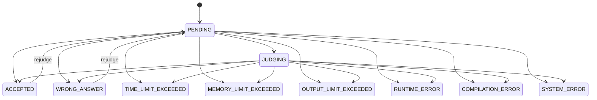

# Domain model

## Identity

**User** (`services/auth/internal/domain/entity/user.go`) is identified by UUID string and owns username/email, bcrypt password hash, RBAC role, activation and suspension flags, rating, profile attributes, and optional MinIO avatar URL/object key. A new user defaults to `user`, inactive and rating 0. `IsActive` means email/account activation and is changed by `Activate`; it is not a moderation flag. `IsSuspended` is independent administrative access control and is changed by `Suspend`/`Unsuspend`. Public profile lookup returns a profile only for active, unsuspended users and otherwise behaves as not found. `UpdatePassword`, `UpdateProfile`, `UploadAvatar`, and `AssignRole` are the remaining domain-level transitions. Profile social URLs accept only `http` and `https`. Username and email are unique in persistence.

## Problem catalogue

**Problem** has title/slug; separate markdown-like `description`, `input_format`, and `output_format` prose; difficulty (`easy`, `medium`, `hard`), tags, examples, constraints, hints, limits, author, hidden flag and soft-delete timestamp (`services/problem/internal/domain/entity/problem.go`). `author_id` is assigned from authenticated claims on create and is the authoritative ownership field. Examples are public sample input/output pairs, not the private testcase bundle. A Problem is created hidden; its Contributor owner may edit or delete that draft, while publication/hiding and arbitrary author moderation require Moderator/Admin. Once published, Contributor editing is blocked until a Moderator/Admin returns it to hidden state. A hidden/deleted problem is not generally public. **Tag** has name/unique slug, description and active state. **TestCase** is one versioned ZIP bundle metadata record per problem: object key, test count and version. The test bundle contents are not domain-persisted in PostgreSQL.

## Submission and attempts

**Submission** stores immutable-at-creation contestant source/language/problem/user identity plus mutable current attempt, status and aggregate execution information (`services/submission/internal/domain/entity/submission.go`). Supported executable submission languages are CPP, Go, Python and Java; C and JavaScript parse but `IsExecutable` rejects them for official submission creation.

The code defines terminal statuses as Accepted, Wrong Answer, time/memory/output limit, runtime, compilation and system errors. The diagram describes transitions supported by current methods/use cases; it is not a database-enforced state machine.

Self profile statistics count every Submission row for totals; `attempted_problems` is the distinct submitted `problem_id` count regardless of `Submission.Status`, so `PENDING` and `JUDGING` count. Accepted submissions and solved problems use current `ACCEPTED` rows; solved is distinct problem IDs with at least one current accepted Submission. Terminal verdict distribution excludes unfinished lifecycle states. A rejudge resets the same Submission current state, so it can change solved status but not attempted status.

**SubmissionAttempt** is the immutable audit/provenance record for each submit or admin rejudge: unique `attempt_id`, trigger, triggering user, eventual status and testcase version/count/checksum. **SubmissionResult** is a per-testcase record tied to a submission and attempt. Results are replaced for the applied attempt, allowing detail APIs to show the current attempt’s output without retaining official inputs/expected output from worker messages.

## Queue and execution contracts

`pkg/judge.JobMessage` carries submission/problem/user/language/source/attempt and enqueue time. `pkg/judge.ResultMessage` carries aggregate status, compile/error information, metrics, testcase provenance and per-test summary. The attempt ID is explicitly documented as the idempotency key.

**Execution** (`workers/judge/internal/application/port/outbound`) consists of an execution request, language commands, resource limits, and testcase results. The worker maps executor statuses into public submission verdicts. For official jobs it removes input and expected output before publishing (`sanitizeOfficialResult`), preserving testcase confidentiality.
