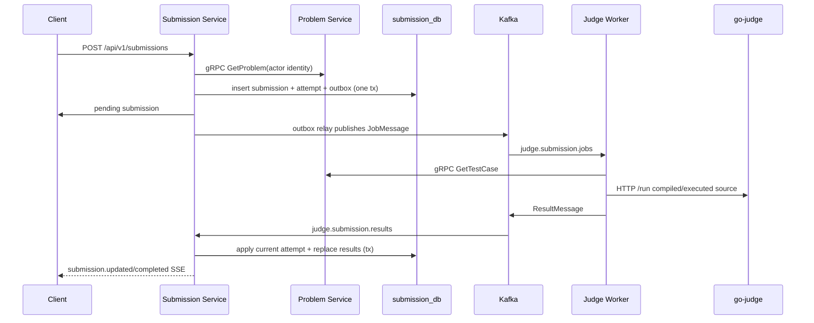

# Execution flows

## Official submission and verdict delivery

Code trace:

1. `services/submission/internal/adapter/inbound/http/handler/user/create_submission.go` parses the request and gateway claims.
2. `internal/application/usecase/user/create_submission.go` validates ID/language/source, calls `outbound/problem/grpc_client.go`, allocates an attempt ID, then persists submission/attempt/job outbox through `persistence/postgres/tx_manager.go`.
3. `outbound/outbox/relay.go` polls pending messages and publishes them. The Kafka job contract is `pkg/judge/job_message.go`.
4. `workers/judge/internal/adapter/inbound/kafka/judge_job_consumer.go` distributes claim messages through a pool. `process_judge_job.go` fetches metadata, loads official testcases, executes, sanitizes official data, and publishes.
5. `outbound/testcase/official_loader.go` reads/cache-verifies downloaded ZIPs. `outbound/execute/go_judge_client.go` compiles/runs against executorserver and maps results; it preserves `OUTPUT_LIMIT_EXCEEDED` and expands output capture for known expected-output size.
6. `services/submission/internal/adapter/inbound/kafka/judge_result_consumer.go` invokes `application/usecase/result/apply_judge_result.go`. The event hub then feeds the SSE handler in `adapter/inbound/http/handler/user/submission_events.go`.

## Interactive Run Code

`POST /api/v1/submissions/run` is synchronous. The user handler calls `application/usecase/user/run_code.go`, which validates source/testcase/limit caps from `submission/config/config.yaml`. The Submission gRPC runner calls Judge Worker's `JudgeService.RunCode`; worker gRPC adapter/handler executes through the same go-judge client and returns diagnostic/test outputs. It does not enter Kafka or persist an official submission.

## Authentication and revocation

Auth handlers call use cases in `services/auth/internal/application/usecase/auth/`. Registration creates an inactive user, sends mail through SMTP and verification activates it. Login/refresh produce JWT-related responses using the JWT adapter. Logout-all records an issued-at threshold in Redis. Protected gateway routes validate the cookie JWT and propagate identity headers; each receiving service's `pkg/middleware/auth.go` checks the Redis threshold and installs typed claims in Gin context. Role checks follow with `pkg/middleware/role.go`.

## Testcase upload and worker delivery

Admin testcase upload goes from Problem HTTP handler -> admin testcase use case -> MinIO storage + `test_cases` upsert. Worker `GetTestCase` gRPC receives only a problem ID and returns presigned access metadata. The Worker loader validates ZIP metadata, limits compressed/extracted bytes, rejects symlinks/path escape, pairs numeric files and keeps a content checksum for provenance.

## Rejudge

An admin rejudge route creates a new attempt ID and resets the mutable Submission state, then enqueues a new job via the same outbox path (`application/usecase/admin/rejudge_submission.go`). A result is applied only to the current matching attempt, preventing stale worker results from overwriting a subsequent rejudge.
