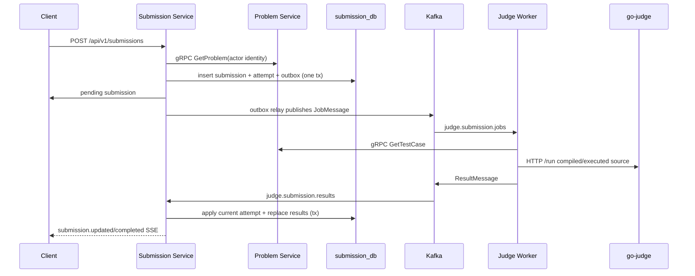

# Execution flows

## Official submission and verdict delivery

Code trace:

1. `services/submission/internal/adapter/inbound/http/handler/user/create_submission.go` parses the request and gateway claims.
2. `internal/application/usecase/user/create_submission.go` validates ID/language/source, calls `outbound/problem/grpc_client.go`, allocates an attempt ID, then persists submission/attempt/job outbox through `persistence/postgres/tx_manager.go`.
3. `outbound/outbox/relay.go` polls pending messages and publishes them. The Kafka job contract is `pkg/judge/job_message.go`.
4. `workers/judge/internal/adapter/inbound/kafka/judge_job_consumer.go` distributes claim messages through a pool. `process_judge_job.go` fetches metadata, loads official testcases, executes, sanitizes official data, and publishes.
5. `outbound/testcase/official_loader.go` reads/cache-verifies downloaded ZIPs. `outbound/execute/go_judge_client.go` compiles/runs against executorserver and maps results; it preserves `OUTPUT_LIMIT_EXCEEDED` and expands output capture for known expected-output size.
6. `services/submission/internal/adapter/inbound/kafka/judge_result_consumer.go` invokes `application/usecase/result/apply_judge_result.go`. The event hub then feeds the SSE handler in `adapter/inbound/http/handler/user/submission_events.go`.

## Interactive Run Code

`POST /api/v1/submissions/run` is synchronous. The user handler calls `application/usecase/user/run_code.go`, which validates source/testcase/limit caps from `submission/config/config.yaml`. The Submission gRPC runner calls Judge Worker's `JudgeService.RunCode`; worker gRPC adapter/handler executes through the same go-judge client and returns diagnostic/test outputs. It does not enter Kafka or persist an official submission.

## Self profile statistics

`GET /api/v1/me/profile-stats` follows gateway-derived authenticated claims to a Submission-only use case. It issues a fixed set of PostgreSQL aggregate/group queries over the caller's `submissions` rows for totals, distinct attempted problems, current terminal verdicts, languages, and the last 365 UTC submission days. It has no Auth/Problem dependency and does not load paginated submission history into the application.

## Public competitive profile statistics

`GET /api/v1/users/:username/profile-stats` is public at the gateway but is owned by Submission. Its use case first calls Auth's internal `PublicUserService.ResolvePublicUser(username)`, which is the source of truth for a stable ID and active/non-suspended public visibility. Only then does Submission execute the same bounded aggregate queries against `submission_db` using that ID. It returns totals, current-status verdict/language distributions and the 365-day UTC activity series only—never individual submissions, source code, testcases, ranking or rating. Auth `NotFound` is mapped to the same public-profile not-found response for missing, inactive and suspended accounts; an Auth timeout/unavailable error becomes 503. A suspension immediately after resolve can race with the read, so visibility is rechecked on the next request rather than cached.

## Public user discovery

`GET /api/v1/users/search?q=...` is a public gateway route to Auth. The Auth use case trims and bounds the query, and its PostgreSQL repository applies a parameterized case-insensitive username/full-name match with literal LIKE wildcard escaping. The database query restricts results and pagination totals to `is_active = true AND is_suspended = false`, matching public-profile visibility. It returns only public identity preview fields for browser navigation to `/u/{username}`; no Submission dependency or public judging statistics are involved.

## Authentication and revocation

Auth handlers call use cases in `services/auth/internal/application/usecase/auth/`. Registration creates an inactive user, sends mail through SMTP and verification activates it. Login and refresh both load the current user and reject inactive or suspended accounts before issuing tokens. Logout-all records an issued-at threshold in Redis. An admin suspension, authenticated password change, and successful password reset write the same threshold before their database mutation, which immediately rejects access tokens issued at or before that moment in protected-service middleware; password persistence failure therefore returns an error while keeping old sessions invalidated. Password reset atomically consumes its one-time Redis token before this invalidation step, so any later failure requires the user to request a new reset token rather than allowing replay. Unsuspension leaves the threshold in place and therefore requires a new login. Protected gateway routes validate the cookie JWT and propagate identity headers; each receiving service's `pkg/middleware/auth.go` checks the Redis threshold and installs typed claims in Gin context. Role checks follow with `pkg/middleware/role.go`.

## Testcase upload and worker delivery

Testcase upload goes from the shared Problem authoring HTTP handler -> testcase use case -> MinIO storage + `test_cases` upsert. A Contributor must own the hidden Problem; Moderator/Admin may manage arbitrary Problems. Worker `GetTestCase` gRPC receives only a problem ID and returns presigned access metadata. The Worker loader validates ZIP metadata, limits compressed/extracted bytes, rejects symlinks/path escape, pairs numeric files and keeps a content checksum for provenance.

Problem authoring keeps public statement prose, input format, output format, public examples, and private testcase bundles separate. Legacy statement normalization is run manually through `services/problem/cmd/backfill-problem-formats`: it first reports eligible/skipped rows, and only `--apply` writes all three text fields for one row atomically. It never reads or changes private testcase bundles.

## Rejudge

An admin rejudge route creates a new attempt ID and resets the mutable Submission state, then enqueues a new job via the same outbox path (`application/usecase/admin/rejudge_submission.go`). A result is applied only to the current matching attempt, preventing stale worker results from overwriting a subsequent rejudge.
