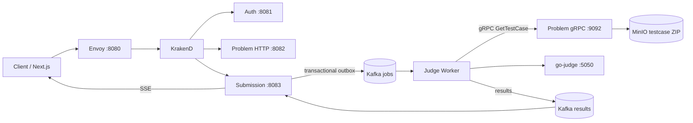

# Codebase overview

## Purpose

Go Judge System is an online-judge backend. It manages identities, authoring and serving programming problems, durable submission intake, asynchronous judging, and result delivery. The browser application in `website/` is a separate Next.js client; the Go services are the backend system of record.

## Architecture at a glance

The repository is a Go workspace with five modules: the shared `pkg/` module plus `services/auth`, `services/problem`, `services/submission`, and `workers/judge` (`go.work`). Each Go service uses a ports-and-adapters shape: `cmd/server` composes dependencies with Google Wire; `internal/domain` holds entities/errors; `internal/application` exposes use cases and port interfaces; and `internal/adapter` implements HTTP/gRPC/Kafka/storage concerns.

Public traffic enters Envoy on port 8080, then KrakenD. KrakenD validates HS256 JWTs on protected endpoints and propagates identity headers. Auth, Problem, and Submission are independently deployable HTTP services. Problem and Judge Worker additionally expose internal gRPC servers. The durable judging path is Kafka-based and uses a submission-side transactional outbox.

## Components

| Component | Role | Main evidence |
| --- | --- | --- |
| Envoy + KrakenD | Public edge, gateway routing, JWT validation/claim propagation | `envoy/envoy.yaml`, `gateway/krakend.tmpl`, `gateway/settings/` |
| Auth Service | Accounts, credentials, JWTs, verification/reset mail, profiles/avatars, roles | `services/auth/` |
| Problem Service | Problems, tags, testcase bundle metadata and object storage | `services/problem/` |
| Submission Service | Submission/attempt/result persistence, outbox, Kafka result consumption, SSE, ad-hoc run-code orchestration | `services/submission/` |
| Judge Worker | Kafka job consumer and internal run-code gRPC service; invokes executor sandbox | `workers/judge/` |
| PostgreSQL | One server, three database names: `auth_db`, `problem_db`, `submission_db` | `infra/postgres/init.sql`, service configs |
| Redis | Auth `logout-all` issued-at invalidation store; configured for all services but not evidenced as used by Problem/Submission | `pkg/auth/logout_all_iat_store.go`, `services/auth/internal/adapter/outbound/cache/redis/` |
| Kafka | Job, result, and dead-letter topics | `infra/kafka/kafka-init.sh`, `pkg/judge/` |
| MinIO | Avatars and testcase ZIP bundles | respective MinIO adapters |
| go-judge / executorserver | Executes untrusted submissions behind the worker | `build/sandbox/Dockerfile`, worker execute adapter |

## High-level data flow

See [ARCHITECTURE.md](ARCHITECTURE.md) for communication and layers, [FLOWS.md](FLOWS.md) for code-level traces, and [TECH_DEBT.md](TECH_DEBT.md) for verified limitations and risks.

## Technology inventory

Go 1.25.8 workspace, Gin, GORM with PostgreSQL, Sarama/Kafka, grpc-go, Viper, Zap, MinIO SDK, Redis, Google Wire, Docker Compose, Envoy, KrakenD, and Next.js. No Kubernetes manifests, Makefile, CI workflow, SQL migration framework, or protobuf generation configuration were found in this checkout. Schema evolution is currently performed by GORM `AutoMigrate` during repository construction.
