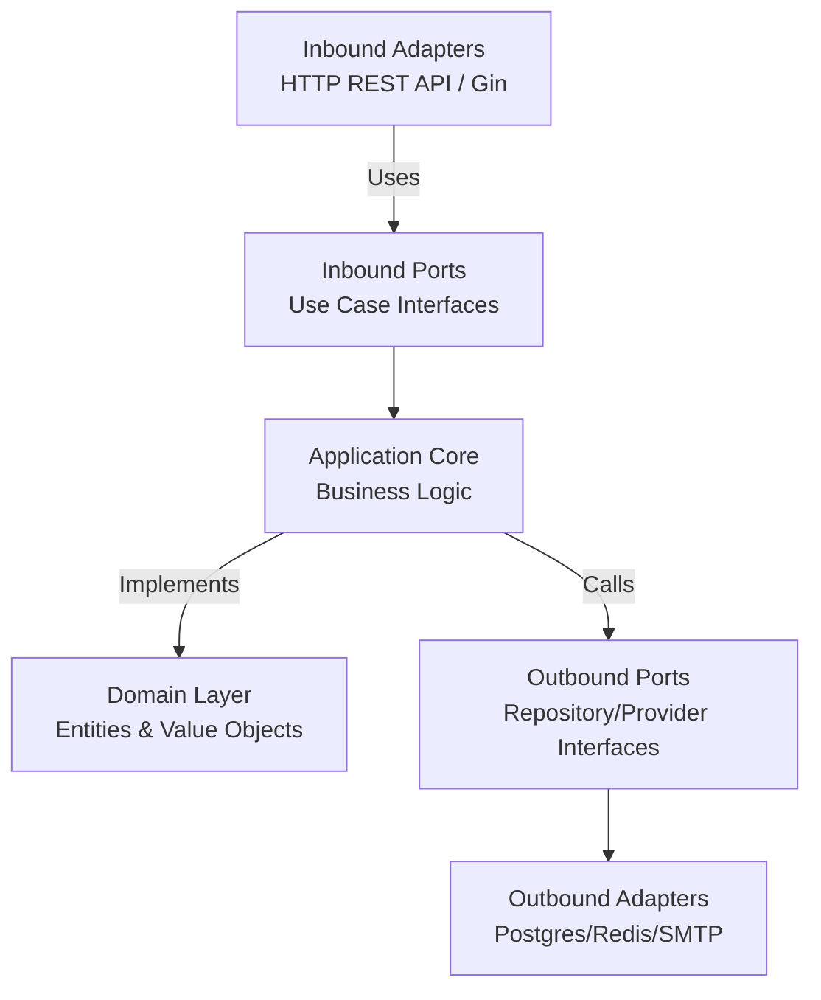

# 🔐 Go Judge System - Authentication Service


The **Authentication Service** is a core microservice of the **Go Judge System**. It is responsible for secure user identity management, registration, session handling, and credential recovery. 

Built with **Go**, this service strictly adheres to **Hexagonal Architecture (Ports and Adapters)** to ensure high testability, maintainability, and separation of concerns.

---

## ✨ Key Features

- **Secure Authentication**: Implementation of JWT (JSON Web Tokens) with short-lived access tokens and secure refresh tokens.
- **Robust Session Management**: Support for cookie-based and Bearer token authentication.
- **Account Verification & Recovery**: Integrated OTP (One-Time Password) mechanism via email (MailHog for local dev) for account activation and password reset.
- **Clean Architecture**: Domain-centric design decoupled from frameworks and databases.
- **Dependency Injection**: Compile-time DI using Google Wire for safe, automated wiring of dependencies.
- **Containerized**: Fully Dockerized with multi-stage builds for minimal image size.
- **Structured Logging**: Configurable log rotation and file management using Lumberjack.

---

## 🏗️ Architecture & Design Patterns

This service is engineered following **Hexagonal Architecture**, ensuring that business logic remains entirely agnostic of external technologies (databases, web frameworks, external APIs).



### Directory Structure Overview
- `cmd/server/`: Application entry point and DI setup using Google Wire.
- `internal/domain/`: Core business models (`User`), value objects (`Email`, `Password`), and domain exceptions.
- `internal/application/`: Application use cases, DTOs, and interface definitions (Ports).
- `internal/adapter/`: Concrete implementations of ports.
  - `inbound/http/`: Gin HTTP handlers, routes, and middlewares.
  - `outbound/`: PostgreSQL persistence, Redis caching, JWT provider, SMTP mailer.

---

## 💻 Technology Stack

| Category | Technology |
| :--- | :--- |
| **Language** | Go 1.24 |
| **Web Framework** | Gin Web Framework |
| **Database** | PostgreSQL 15 |
| **Cache & State** | Redis 7 |
| **Dependency Injection** | Google Wire |
| **Authentication** | golang-jwt/jwt |
| **Mail Testing** | MailHog (SMTP) |
| **Infrastructure** | Docker, Docker Compose |

---

## 🚀 Getting Started

### Prerequisites
- Docker Engine & Docker Compose (for containerized execution)
- Go 1.24+ (for local development)

### Quick Start (Docker Compose)

The easiest way to run the service along with its dependencies (PostgreSQL, Redis, MailHog) is via Docker Compose.

1. **Set up Environment Variables**: Ensure your `.env` files are configured in the `environment/` directory at the project root.
2. **Launch the Stack**:
   ```bash
   docker compose up -d auth-service
   ```
3. **Verify the Service**: The API will be available at `http://localhost:8081`. You can view outgoing local emails at the MailHog UI: `http://localhost:8025`.

### Local Development Setup

1. **Install Dependencies**:
   ```bash
   go mod download
   ```
2. **Generate DI Code** (If you modify constructors):
   ```bash
   cd internal/container
   wire
   ```
3. **Run the Server**:
   ```bash
   export DATABASE_PASSWORD=your_db_password
   export REDIS_PASSWORD=your_redis_password
   export JWT_ACCESS_SECRET=your_secret_key
   export JWT_REFRESH_SECRET=your_refresh_key
   
   go run cmd/server/main.go
   ```

---

## 📡 API Reference

### Public Endpoints

| Method | Endpoint | Description |
| :--- | :--- | :--- |
| `POST` | `/api/v1/auth/register` | Create a new user account |
| `POST` | `/api/v1/auth/verify-activation`| Verify email OTP to activate account |
| `POST` | `/api/v1/auth/resend-otp` | Resend activation OTP |
| `POST` | `/api/v1/auth/login` | Authenticate and retrieve JWT tokens |
| `POST` | `/api/v1/auth/refresh-token` | Obtain a new access token via refresh token |
| `POST` | `/api/v1/auth/forgot-password` | Request password reset OTP |
| `POST` | `/api/v1/auth/verify-forgot-password`| Verify reset OTP |
| `POST` | `/api/v1/auth/reset-password` | Set a new password |
| `GET` | `/api/v1/auth/profile/:username`| Fetch public user profile |

### Protected Endpoints (Requires Valid JWT)

*Send the token via the `Authorization: Bearer <token>` header or as an `access_token` cookie.*

| Method | Endpoint | Description |
| :--- | :--- | :--- |
| `GET` | `/api/v1/auth/profile` | Retrieve the authenticated user's profile |
| `PUT` | `/api/v1/auth/change-password` | Update current password |
| `POST` | `/api/v1/auth/logout` | Invalidate current session |

---

## ⚙️ Configuration

The service utilizes a hybrid configuration model prioritizing security and flexibility:

1. **`config/config.yaml`**: Contains public/non-sensitive configuration such as server ports, database connection pools, log levels, and cache TTLs.
2. **Environment Variables Configs**: Overwrites sensitive YAML paths dynamically (e.g., `DATABASE_PASSWORD` overwrites `database.password`).

---
*Built with ❤️ for the Go Judge System.*
