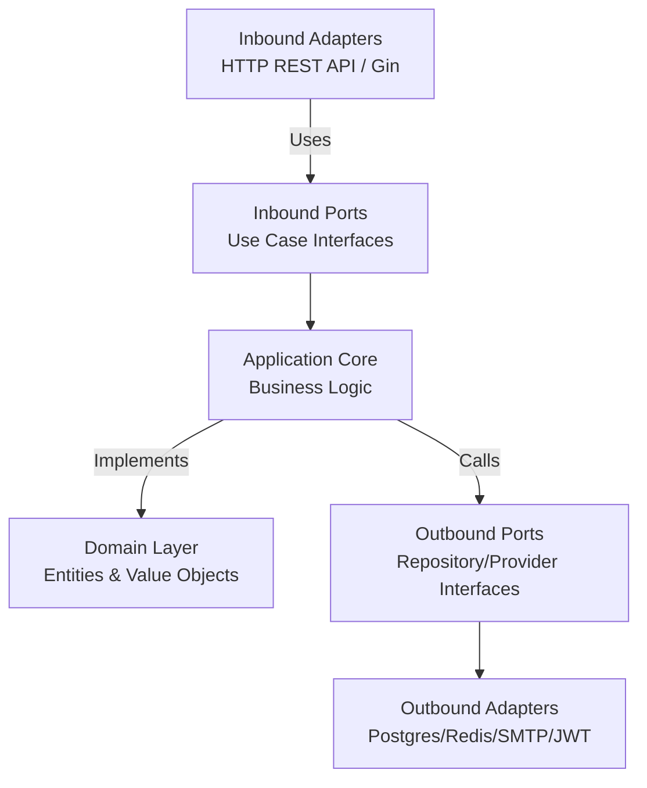

# 🔐 Go Judge System - Authentication Service


The **Authentication Service** is a core microservice of the **Go Judge System**. It handles user identity, account lifecycle, token issuance, password recovery, and role management.

Built with **Go**, this service follows **Hexagonal Architecture (Ports and Adapters)** to keep business logic isolated from frameworks, storage, and delivery concerns.

---

## ✨ Key Features

- **JWT-based authentication**: Short-lived access tokens and refresh-token flow.
- **OTP verification flows**: Account activation and password reset via SMTP email.
- **Role-aware access control**: Supports `user`, `admin`, and `super_admin` authorization paths.
- **Hexagonal architecture**: Clear separation of domain, use cases, ports, and adapters.
- **Compile-time dependency injection**: Powered by Google Wire.
- **Container-ready**: Multi-stage Docker build and health check support.
- **Structured logging**: File-based logging with rotation.

---

## 🏗️ Architecture & Design Patterns

This service is structured around **Hexagonal Architecture**, allowing business rules to stay independent from Gin, PostgreSQL, Redis, and SMTP.



### Directory Structure Overview
- `cmd/server/`: Application entry point and Wire injector setup.
- `internal/domain/`: Entities, value objects, and domain errors.
- `internal/application/`: DTOs, ports, and use-case implementations.
- `internal/adapter/`: Inbound HTTP handlers and outbound integrations.
  - `inbound/http/`: Gin handlers, router, and middleware.
  - `outbound/`: PostgreSQL, Redis, JWT, OTP, mail, and crypto adapters.

---

## 💻 Technology Stack

| Category | Technology |
| :--- | :--- |
| **Language** | Go 1.24 |
| **Web Framework** | Gin |
| **Database** | PostgreSQL 15 |
| **Cache & State** | Redis 7 |
| **Dependency Injection** | Google Wire |
| **Authentication** | JWT |
| **Mail Testing** | MailHog |
| **Infrastructure** | Docker, Docker Compose |

---

## 🚀 Getting Started

### Prerequisites
- Docker Engine and Docker Compose
- Go 1.24+

### Quick Start (Docker Compose)

1. Configure the environment files under the project-level `environment/` directory.
2. Start the service and its dependencies:
   ```bash
   docker compose up -d auth-service
   ```
3. Verify the service:
   - API: `http://localhost:8081`
   - Health check: `http://localhost:8081/health`
   - MailHog UI: `http://localhost:8025`

### Local Development Setup

1. Install dependencies:
   ```bash
   go mod download
   ```
2. Regenerate Wire code when constructor wiring changes:
   ```bash
   cd cmd/server
   wire
   ```
3. Run the server:
   ```bash
   export DATABASE_PASSWORD=your_db_password
   export REDIS_PASSWORD=your_redis_password
   export JWT_ACCESS_SECRET=your_access_secret
   export JWT_REFRESH_SECRET=your_refresh_secret

   go run ./cmd/server
   ```

---

## 📡 API Reference

### Public Endpoints

| Method | Endpoint | Description |
| :--- | :--- | :--- |
| `POST` | `/api/v1/auth/register` | Register a new account |
| `POST` | `/api/v1/auth/verify-activation` | Verify activation OTP |
| `POST` | `/api/v1/auth/resend-otp` | Resend activation OTP |
| `POST` | `/api/v1/auth/forgot-password` | Request password-reset OTP |
| `POST` | `/api/v1/auth/verify-forgot-password` | Verify password-reset OTP |
| `POST` | `/api/v1/auth/reset-password` | Reset password with verified OTP |
| `POST` | `/api/v1/auth/login` | Login and receive tokens |
| `POST` | `/api/v1/auth/refresh-token` | Refresh access token |
| `GET` | `/api/v1/auth/profile/:username` | Get public profile by username |

### Authenticated Endpoints

Send the token via `Authorization: Bearer <token>` or the `access_token` cookie.

| Method | Endpoint | Description |
| :--- | :--- | :--- |
| `GET` | `/api/v1/auth/profile` | Get current user's profile |
| `PUT` | `/api/v1/auth/change-password` | Change current password |
| `POST` | `/api/v1/auth/logout` | Logout current session |

### Super Admin Endpoints

| Method | Endpoint | Description |
| :--- | :--- | :--- |
| `PUT` | `/api/v1/auth/admin/:username/role` | Update a user's role |

---

## ⚙️ Configuration

The service uses a hybrid configuration model:

1. `config/config.yaml` contains non-sensitive runtime configuration such as server settings, logging, database host, Redis host, SMTP host, and JWT TTLs.
2. Environment variables override secret fields such as `database.password`, `redis.password`, `jwt.access_secret`, and `jwt.refresh_secret`.

---
Built for the Go Judge System.
