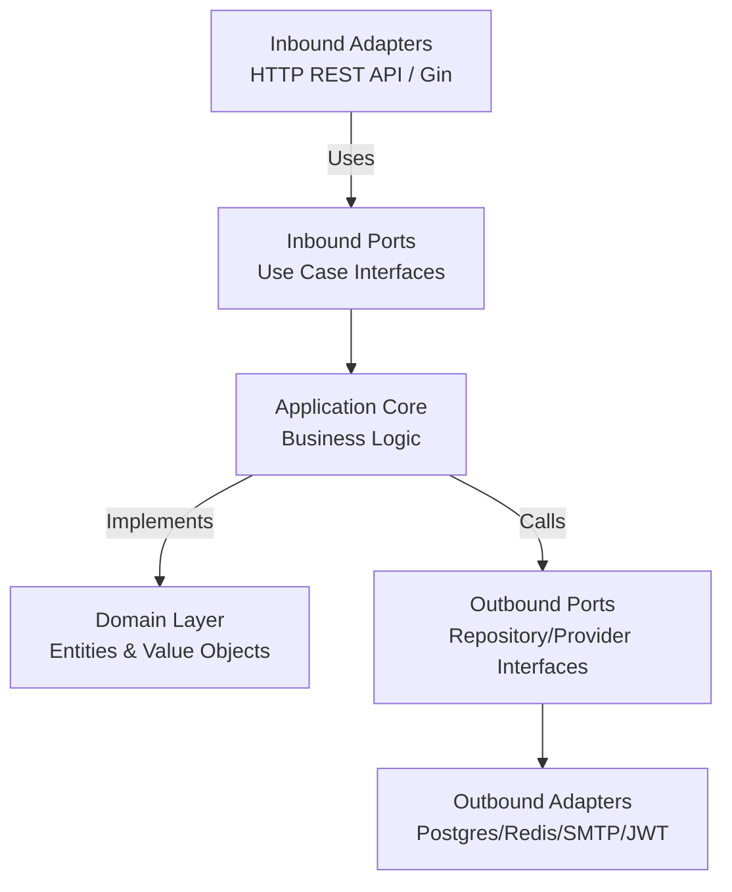

# Go Judge System - Authentication Service


The **Authentication Service** is a core microservice of the **Go Judge System**. It handles user identity, account lifecycle, token issuance, password recovery, and role management.

Built with **Go**, this service follows **Hexagonal Architecture (Ports and Adapters)** to keep business logic isolated from frameworks, storage, and delivery concerns.

---

## Key Features

- **JWT-based authentication**: Short-lived access tokens and refresh-token flow.
- **OTP verification flows**: Account activation and password reset via SMTP email.
- **Role-aware access control**: Supports `user`, `admin`, and `super_admin` authorization paths.
- **Hexagonal architecture**: Clear separation of domain, use cases, ports, and adapters.
- **Compile-time dependency injection**: Powered by Google Wire.
- **Container-ready**: Multi-stage Docker build and health check support.
- **Structured logging**: File-based logging with rotation.

---

## Architecture & Design Patterns

This service is structured around **Hexagonal Architecture**, allowing business rules to stay independent from Gin, PostgreSQL, Redis, and SMTP.


```mermaid
graph TD
    Inbound[Inbound Adapters<br/>HTTP REST API / Gin] --> |Uses| PortIn[Inbound Ports<br/>Use Case Interfaces]
    PortIn --> AppCore[Application Core<br/>Business Logic]
    AppCore --> |Implements| Domain[Domain Layer<br/>Entities & Value Objects]
    AppCore --> |Calls| PortOut[Outbound Ports<br/>Repository/Provider Interfaces]
    PortOut --> Outbound[Outbound Adapters<br/>Postgres/Redis/SMTP/JWT]
```

### Directory Structure Overview
- `cmd/server/`: Application entry point and Wire injector setup.
- `internal/domain/`: Entities, value objects, and domain errors.
- `internal/application/`: DTOs, ports, and use-case implementations.
- `internal/adapter/`: Inbound HTTP handlers and outbound integrations.
  - `inbound/http/`: Gin handlers, router, and middleware.
  - `outbound/`: PostgreSQL, Redis, JWT, OTP, mail, and crypto adapters.

---

## Technology Stack

| Category | Technology |
| :--- | :--- |
| **Language** | Go 1.24 |
| **Web Framework** | Gin |
| **Database** | PostgreSQL 15 |
| **Cache & State** | Redis 7 |
| **Dependency Injection** | Google Wire |
| **Authentication** | JWT |
| **Mail Testing** | MailHog |
| **Infrastructure** | Docker, Docker Compose |

---

## Getting Started

### Prerequisites
- Docker Engine and Docker Compose

### Quick Start (Docker Compose)

1. Configure the environment files under the project-level `environment/` directory.
2. Start the service and its dependencies:
   ```bash
   docker compose up -d auth-service
   ```
3. Verify the service from inside the Docker network or through the gateway:
   - Public API: `http://localhost:8080/api/v1/auth/...`
   - Health check: use `docker compose exec auth-service wget -qO- http://localhost:8081/health`
   - MailHog UI (dev profile): `http://localhost:8025`

---

## API Reference

### Public Endpoints

| Method | Endpoint | Description |
| :--- | :--- | :--- |
| `POST` | `/api/v1/auth/register` | Register a new account |
| `POST` | `/api/v1/auth/email/verify` | Verify email token |
| `POST` | `/api/v1/auth/email/resend-verification` | Resend verification email |
| `POST` | `/api/v1/auth/password/forgot` | Request password reset |
| `POST` | `/api/v1/auth/password/reset` | Reset password with token |
| `POST` | `/api/v1/auth/login` | Login and receive tokens |
| `POST` | `/api/v1/auth/refresh-token` | Refresh access token |
| `GET` | `/api/v1/users/:username/profile` | Get public profile by username |

### Authenticated Endpoints

Protected routes are expected to be called through the gateway, which validates the `access_token` cookie and injects `X-User-*` headers for the auth service.

| Method | Endpoint | Description |
| :--- | :--- | :--- |
| `GET` | `/api/v1/me` | Get current user's profile |
| `PATCH` | `/api/v1/me/profile` | Update current user's core profile |
| `POST` | `/api/v1/me/avatar` | Upload current user's avatar |
| `PUT` | `/api/v1/auth/password/change` | Change current password |
| `POST` | `/api/v1/auth/logout` | Logout current session |
| `POST` | `/api/v1/auth/logout-all` | Logout all sessions |

### Admin Endpoints

| Method | Endpoint | Description |
| :--- | :--- | :--- |
| `PUT` | `/api/v1/admin/users/:user_id/role` | Update a user's role |

### Profile Response

`GET /api/v1/me`

```json
{
  "status": "success",
  "code": 20000,
  "data": {
    "id": "2a1d2d8e-8d7f-4f39-8a18-4db0f4bcbfd5",
    "full_name": "Jane Doe",
    "username": "janedoe",
    "email": "jane@example.com",
    "role": "user",
    "rating": 0,
    "is_active": true,
    "avatar_url": "https://cdn.example.com/avatar.png",
    "bio": "Competitive programmer",
    "country": "Vietnam",
    "school": "HCMUS",
    "company": "Go Judge",
    "github_url": "https://github.com/janedoe",
    "website_url": "https://janedoe.dev",
    "linkedin_url": "https://www.linkedin.com/in/janedoe",
    "created_at": "2026-06-29T10:30:00+07:00",
    "updated_at": "2026-06-29T10:45:00+07:00"
  }
}
```

`GET /api/v1/users/:username/profile` returns the same core profile fields except `email`.

### Update Profile Request

`PATCH /api/v1/me/profile`

```json
{
  "full_name": "Jane Doe",
  "avatar_url": "https://cdn.example.com/avatar.png",
  "bio": "Competitive programmer",
  "country": "Vietnam",
  "school": "HCMUS",
  "company": "Go Judge",
  "github_url": "https://github.com/janedoe",
  "website_url": "https://janedoe.dev",
  "linkedin_url": "https://www.linkedin.com/in/janedoe"
}
```

### Upload Avatar Request

`POST /api/v1/me/avatar`

- `Content-Type: multipart/form-data`
- Form field: `avatar`

Success response:

```json
{
  "status": "success",
  "code": 20000,
  "data": {
    "avatarUrl": "http://localhost:9000/avatars/users/{userID}/xxx.png"
  }
}
```

---

## Configuration

The service uses a hybrid configuration model:

1. `config/config.yaml` contains non-sensitive runtime configuration such as server settings, logging, database host, Redis host, SMTP host, and JWT TTLs.
2. Environment variables override secret fields such as `database.password`, `redis.password`, `jwt.access_secret`, and `jwt.refresh_secret`.
3. The application loads configuration from `/app/config` at runtime, so Docker Compose is the supported execution path without additional path remapping.

Current default runtime profile:

- Service name: `auth-service`
- Port: `8081`
- Database: `auth_db`
- Redis: `redis:6379`
- MailHog SMTP: `mailhog:1025`

### Public-auth abuse controls

`auth_abuse` in `config/config.yaml` configures Redis-backed fixed-window
limits. Redis keys use `auth:abuse:<purpose>:<sha256(normalized-scope)>`; raw
emails, identifiers, refresh tokens, and IP addresses are not placed in keys.
The Lua `INCR`/`PEXPIRE` operation is atomic across Auth replicas. Login,
registration, verification/reset token consumption, and refresh fail closed
with a safe 503/429 if the limiter is unavailable. Resend-verification and
forgot-password instead return their existing generic success response while
sending no email, so Redis or quota state cannot reveal whether an account
exists. Envoy strips and overwrites `X-Client-IP` from its downstream peer;
Auth never trusts client-provided forwarding headers.

This assumes Envoy's downstream peer is the end-user connection. If a CDN,
load balancer, or another reverse proxy is added ahead of Envoy, this boundary
must be redesigned with an explicit trusted-proxy chain before relying on the
header for abuse controls.

With an isolated, source-built non-production stack running behind Envoy, run
the black-box regression test with
`AUTH_CLIENT_IP_TRUST_INTEGRATION_BASE_URL=http://127.0.0.1:8080 go test
./internal/adapter/inbound/http -run TestClientIPTrustIntegration -count=1`.
It verifies that rotating client-supplied `X-Client-IP`, `X-Forwarded-For`, and
`X-Real-IP` cannot create fresh login limiter buckets.

Login records only failed authentication attempts. Its hard controls are the
per-IP-and-normalized-identifier scope and a deliberately high broad-IP scope
for password spraying; identifier-wide failures apply only the configured,
bounded soft delay so they cannot lock an account globally.

---
Built for the Go Judge System.
