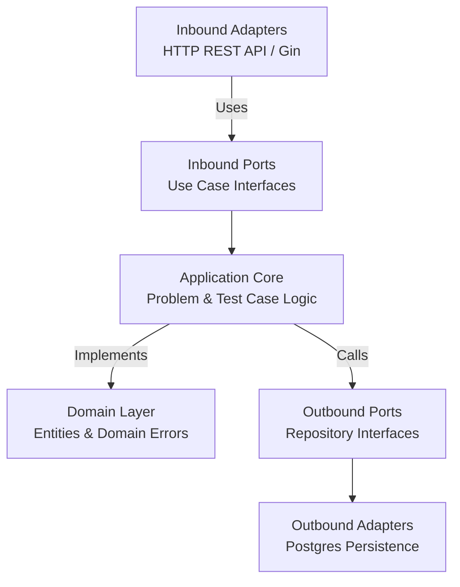

# 🧩 Go Judge System - Problem Service


The **Problem Service** is the microservice responsible for problem authoring, publication state management, public problem retrieval, and test case administration in the **Go Judge System**.

Built with **Go**, this service follows **Hexagonal Architecture (Ports and Adapters)** so problem-management rules stay independent from HTTP delivery, persistence, and gateway concerns.

---

## ✨ Key Features

- **Public problem catalog**: List published problems and retrieve problem details by slug.
- **Admin problem management**: Create, update, hide, publish, and delete problems using stable numeric IDs.
- **Test case management**: Create, list, update, and delete problem-scoped test cases.
- **Role-aware access control**: Protected routes rely on identity headers propagated by the API gateway.
- **Hexagonal architecture**: Clean split between use cases, ports, adapters, and domain models.
- **Compile-time dependency injection**: Wired using Google Wire.
- **Container-ready**: Multi-stage Docker build with health check support.
- **Structured logging**: File logging with configurable rotation settings.

---

## 🏗️ Architecture & Design Patterns

This service uses **Hexagonal Architecture** so the problem domain remains isolated from Gin, PostgreSQL, and gateway-specific concerns.



### Directory Structure Overview
- `cmd/server/`: Application entry point and Wire injector setup.
- `internal/domain/`: Problem and test case entities plus domain errors.
- `internal/application/`: DTOs, ports, and use-case implementations.
- `internal/adapter/`: HTTP handlers, router, middleware, and persistence adapters.
  - `inbound/http/`: Gin handlers, grouped routes, and auth header middleware.
  - `outbound/persistence/postgres/`: Problem and test case repositories.

---

## 💻 Technology Stack

| Category | Technology |
| :--- | :--- |
| **Language** | Go 1.24 |
| **Web Framework** | Gin |
| **Database** | PostgreSQL 15 |
| **Dependency Injection** | Google Wire |
| **Infrastructure** | Docker, Docker Compose |

---

## 🚀 Getting Started

### Prerequisites
- Docker Engine and Docker Compose
- Go 1.24+

### Quick Start (Docker Compose)

1. Configure the environment files under the project-level `environment/` directory.
2. Start the service:
   ```bash
   docker compose up -d problem-service
   ```
3. Verify the service:
   - API: `http://localhost:8082`
   - Health check: `http://localhost:8082/health`

### Local Development Setup

1. Install dependencies:
   ```bash
   go mod download
   ```
2. Regenerate Wire code when constructor wiring changes:
   ```bash
   cd cmd/server
   wire
   ```
3. Run the server:
   ```bash
   export DATABASE_PASSWORD=your_db_password

   go run ./cmd/server
   ```

### Local Access Note

Protected routes in this service expect `X-User-ID`, `X-Username`, and `X-Role` headers injected by the API gateway. For realistic local testing of authenticated endpoints, call the service through the gateway on `http://localhost:8080` or provide those headers manually in direct requests.

---

## 📡 API Reference

### Public Endpoints

| Method | Endpoint | Description |
| :--- | :--- | :--- |
| `GET` | `/api/v1/problems` | List public published problems |
| `GET` | `/api/v1/problems/:slug` | Get public problem detail by slug |

### Authenticated Endpoints

| Method | Endpoint | Description |
| :--- | :--- | :--- |
| `GET` | `/api/v1/my/problems` | List problems owned by the authenticated admin |

### Admin Problem Endpoints

| Method | Endpoint | Description |
| :--- | :--- | :--- |
| `GET` | `/api/v1/admin/problems` | List all problems for super admin review |
| `GET` | `/api/v1/admin/problems/:id` | Get problem detail by ID for management |
| `POST` | `/api/v1/admin/problems` | Create a new problem |
| `PUT` | `/api/v1/admin/problems/:id` | Update an existing problem |
| `DELETE` | `/api/v1/admin/problems/:id` | Delete a problem |
| `PUT` | `/api/v1/admin/problems/:id/publish` | Publish a hidden problem |
| `PUT` | `/api/v1/admin/problems/:id/hide` | Hide a published problem |

### Admin Test Case Endpoints

| Method | Endpoint | Description |
| :--- | :--- | :--- |
| `POST` | `/api/v1/admin/problems/:id/testcases` | Create a test case for a problem |
| `GET` | `/api/v1/admin/problems/:id/testcases` | List all test cases of a problem |
| `PUT` | `/api/v1/admin/testcases/:id` | Update a test case |
| `DELETE` | `/api/v1/admin/testcases/:id` | Delete a test case |

### Routing Convention

- Public user-facing routes use **slug** for readability and stable URLs.
- Admin and mutation routes use **numeric ID** for precise resource targeting.
- Protected routes are separated under `/api/v1/admin` and `/api/v1/my` to avoid path-parameter conflicts and keep access control explicit.

---

## ⚙️ Configuration

The service uses a hybrid configuration model:

1. `config/config.yaml` stores non-sensitive settings such as server mode, port, logger configuration, and database host/pool parameters.
2. Environment variables override secret fields such as `database.password`.

Current default runtime profile:

- Service name: `problem-service`
- Port: `8082`
- Database: `problem_db`
- Log file: `/app/logs/problem.log`

---
Built for the Go Judge System.