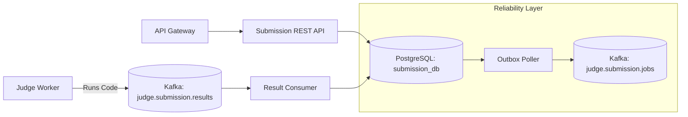

# Go Judge System - Submission Service


The **Submission Service** acts as the primary orchestrator for code execution requests in the **Go Judge System**. It securely accepts user code, persists the submission record using the Transactional Outbox pattern, and reliably dispatches jobs to the Judge Worker via Kafka.

---

## Elevator Pitch & Highlights

- **Reliable messaging**: implements the Transactional Outbox pattern to guarantee that every saved submission is eventually published to Kafka.
- **Event-driven synchronization**: listens to `judge.submission.results` from the worker to update submission verdicts asynchronously.
- **Microservices integration**: works seamlessly behind the API Gateway to handle authenticated user requests.

---

## System Architecture



Processing flow:
1. User submits code via REST API.
2. Service saves the `Submission` and an `OutboxEvent` in a single DB transaction.
3. The Outbox Poller sweeps pending events and publishes them to `judge.submission.jobs`.
4. Sandboxed execution happens entirely in the isolated Judge Worker.
5. Service consumes verdicts from `judge.submission.results` and updates the DB.

---

## Getting Started (Quick Start)

### Prerequisites

- Docker Engine
- Docker Compose

### Start the service

```bash
git clone https://github.com/nvawntien/go-judge-system.git
cd go-judge-system
docker compose --profile dev up -d --build submission-service
```

### Access points

- **Internal Port**: `:8083` inside the Docker network
- **Health Check**: use `docker compose exec submission-service wget -qO- http://localhost:8083/health`
- **Public API**: `http://localhost:8080/api/v1/submissions...`

---

## Folder Structure

```text
services/submission/
├── cmd/server/                 # Application entrypoint & Wire injector
├── config/                     # Configuration schemas
├── internal/
│   ├── adapter/inbound/        # REST controllers and Kafka result consumers
│   ├── adapter/outbound/       # PostgreSQL models and Outbox publisher
│   ├── application/usecase/    # Core business logic for submissions
│   ├── container/              # Dependency injection logic
│   └── domain/                 # Core entities (Submission, Limits, Outbox)
└── Dockerfile                  # Container build instructions
```

---

## Tech Stack

| Category | Technology |
| :--- | :--- |
| **Language** | Go 1.24 |
| **API Framework** | Gin Web Framework |
| **Database** | PostgreSQL (GORM) |
| **Message Broker** | Apache Kafka (Sarama) |
| **Dependency Injection** | Google Wire |

---

## Key APIs & Events

### REST Endpoints

| Method | Route | Description | Auth Required |
| :--- | :--- | :--- | :--- |
| `GET` | `/api/v1/submissions` | List all submissions | No |
| `GET` | `/api/v1/problems/id/:id/submissions` | List submissions for a problem | No |
| `POST` | `/api/v1/submissions` | Create a new code submission | Yes |
| `GET` | `/api/v1/my/submissions` | Get submission history for the authenticated user | Yes |
| `GET` | `/api/v1/my/submissions/:id` | Get details/verdict of one of your submissions | Yes |
| `GET` | `/api/v1/admin/submissions/:id` | Get submission details as an admin | Yes |
| `PUT` | `/api/v1/admin/submissions/:id/rejudge` | Rejudge a submission | Yes |

### Messaging Contracts

- **Produces**: `judge.submission.jobs` (dispatched via Outbox pattern).
- **Consumes**: `judge.submission.results` (updates database with final execution status).

---

## Configuration

The service uses a hybrid configuration model:

1. `config/config.yaml` stores non-sensitive runtime settings such as server mode, port, logger configuration, database host/pool parameters, and Kafka topic names.
2. Environment variables override secret fields such as `database.password`.
3. The application loads configuration from `/app/config` at runtime, so the Docker Compose flow is the supported execution path without additional path remapping.

Current default runtime profile:

- Service name: `submission-service`
- Port: `8083`
- Database: `submission_db`
- Kafka topics: `judge.submission.jobs`, `judge.submission.results`, `judge.submission.jobs.dlt`
- Consumer group: `judge-worker-v1`
