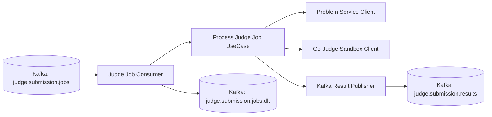

# Go Judge System - Judge Worker


The **Judge Worker** is the asynchronous execution engine of the **Go Judge System**.
It solves the core scaling challenge of online judges by consuming submission jobs from Kafka, running sandboxed execution, and publishing verdicts back to the platform.

---

## Elevator Pitch & Highlights

- **Asynchronous by design**: decouples heavy execution from HTTP request paths.
- **Fault tolerant**: retry with backoff and dead-letter routing.
- **Production oriented**: structured logs, graceful shutdown, contract-based messaging.

---

## System Architecture



Processing flow:
- Consume job message.
- Fetch problem test cases.
- Compile and run source code in sandbox.
- Map execution outcome to final verdict.
- Publish result or route unrecoverable failures to DLT.

---

## Getting Started (Quick Start)

### Prerequisites

- Docker Engine
- Docker Compose
- Running Kafka, problem-service, and sandbox containers

### Start worker

```bash
git clone https://github.com/nvawntien/go-judge-system.git
cd go-judge-system
docker compose --profile worker up -d --build judge-worker
```

### Verify and monitor

```bash
docker compose ps
docker compose logs -f judge-worker
```

### Stop worker

```bash
docker compose stop judge-worker
```

---

## Folder Structure

```text
workers/judge/
├── cmd/server/                           # Entrypoint and Wire injector
├── internal/adapter/inbound/kafka/       # Job consumer and DLT publisher
├── internal/adapter/outbound/execute/    # Sandbox execution client
├── internal/adapter/outbound/problem/    # Problem service client
├── internal/adapter/outbound/judge/      # Result publisher
├── internal/application/usecase/judge/   # Core orchestration
├── internal/container/                   # App lifecycle and providers
└── config/config.yaml                    # Runtime configuration
```

---

## Tech Stack

| Category | Technology |
| :--- | :--- |
| **Language** | Go 1.24 |
| **Messaging** | Apache Kafka (Sarama) |
| **HTTP Clients** | Resty, net/http |
| **Execution Runtime** | criyle/executorserver-based sandbox |
| **Logging** | Zap |
| **Dependency Injection** | Google Wire |

---

## Key Features / Contracts

### Key operational features

- Parallel message handling with worker pool.
- Retry policy with exponential backoff.
- Dead-letter publishing for unrecoverable failures.
- Graceful shutdown with context-driven draining.

### Message contracts

- Input contract: `pkg/judge/job_message.go`
- Output contract: `pkg/judge/result_message.go`
- DLT contract: `internal/adapter/inbound/kafka/dlt_publisher.go`

### Operational checklist

- Ensure required topics exist:
  - `judge.submission.jobs`
  - `judge.submission.results`
  - `judge.submission.jobs.dlt`
- Validate compatibility with submission-service result consumer before release.

---

## Configuration

The worker uses a container-first configuration model:

1. `config/config.yaml` stores non-sensitive runtime settings such as Kafka brokers, consumer group, topic names, and judging limits.
2. The application loads configuration from `/app/config` at runtime.

Current default runtime profile:

- Service name: `judge-worker`
- Kafka brokers: `kafka:9092`
- Consumer group: `judge-worker-v1`
- Topics: `judge.submission.jobs`, `judge.submission.results`, `judge.submission.jobs.dlt`
- Judge timeout: `30s`
- Memory limit: `256MB`
- Max concurrent jobs: `4`

---
Built for the Go Judge System.
